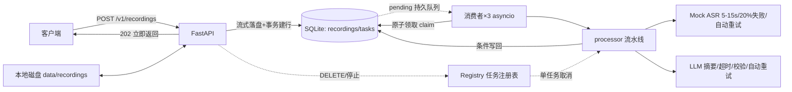

# AudioMuse：录音转写与智能摘要服务

后端实习生笔试项目。客户端上传音频文件，服务端**异步**完成「转写」（Mock ASR，
模拟真实行为）与「智能摘要」（真实 LLM，可 mock 兜底），客户端可查询任务状态
与结果。

**当前状态：P0 全部完成**（P0-01 骨架 → P0-08 删除录音），104 项测试通过，
真实 LLM 链路已验证（DeepSeek）。已完成加分项：失败自动重试、上传幂等、并发控制、
测试。尚未实施：SSE 流式输出、公开部署等加分项（见「未完成项」）。

---

## 目录结构

```
AudioMuse/
├── app/
│   ├── main.py             # FastAPI 应用工厂 + lifespan（迁移/独占锁/消费者启停）
│   ├── config.py           # 配置（环境变量前缀 AUDIOMUSE_，支持 .env）
│   ├── api/                # v1 HTTP 路由：recordings（上传/列表/详情/删除）、tasks（查询/重试）
│   ├── core/               # 统一成功/错误响应、X-Request-ID 中间件、日志
│   ├── db/                 # SQLite 连接、幂等迁移(migrations/)、repository（数据访问层）、constants
│   ├── services/           # storage（文件存储）、asr（Mock ASR）、llm（LLM 适配）、pipeline（processor）、registry（任务注册表）
│   └── worker/             # consumer（消费者）、lock（数据目录独占进程锁）
├── docs/                   # 笔试题目、需求分析/开发计划、TODO、sample.wav
├── scripts/
│   ├── start.sh            # 一键启动（首次自动建 .venv 并安装依赖）
│   └── smoke_llm.py        # 真实 LLM 冒烟（读 .env，打印结构化摘要）
├── tests/                  # pytest：health/db/upload/lifespan/worker/pipeline/query/retry/delete
├── api.http                # API 调试文件（VS Code REST Client 可直接运行）
├── pyproject.toml          # 依赖（pip install -e ".[dev]"）
└── .env.example            # 环境变量示例（复制为 .env 使用）
```

## 快速开始

需要本机 Python >= 3.9（macOS 自带即可）。依赖管理用标准库 `venv` + `pip`。

```bash
cp .env.example .env        # 按需修改配置（LLM Key 见下）
scripts/start.sh            # 一键启动（首次自动建 .venv 并安装依赖），默认 0.0.0.0:8000
# 或手动：
#   python3 -m venv .venv && .venv/bin/pip install -e ".[dev]"
#   .venv/bin/uvicorn app.main:app --port 8000
```

验证：

```bash
curl http://127.0.0.1:8000/healthz
# => {"code":"OK","message":"ok","data":{"status":"ok","version":"0.1.0"},"request_id":"..."}
```

端到端体验（另开终端）：用 `api.http`（VS Code REST Client）或：

```bash
# 上传（docs/sample.wav 为占位音频，扩展名校验通过）
curl -F "file=@docs/sample.wav" http://127.0.0.1:8000/v1/recordings
# 稍等片刻后查询任务/详情，done 后即含 transcript 与 summary
```

测试：

```bash
.venv/bin/python -m pytest -q     # 104 passed
```

## 架构图



说明：单进程持有数据目录独占锁；进程内一个事件循环跑 3 个消费者协程；每个消费者
按 `poll_interval` 轮询原子领取 pending 任务（数据库即持久化队列），交给 processor
（转写 → 摘要 → 条件写回 done/failed）；单任务处理可被 `registry` 按任务粒度取消，
取消只停该录音、消费者继续服务其他录音。

### 状态机

```
pending → transcribing → summarizing → done
                │                │
                └──→ failed ←────┘        （任一环节失败，含服务重启中断 WORKER_INTERRUPTED / 手动停止 PROCESSING_CANCELLED）
failed --POST retry--> pending（attempt_no + 1，清理旧结果）
```

### 失败自动重试

- ASR 和 LLM 阶段分别最多自动重试 3 次；首次执行加 3 次重试，即每个阶段最多调用 4 次；
- 采用 1、2、4 秒指数退避，退避使用异步等待；该任务继续占用其消费者名额；
- ASR 只重试明确的 `AsrFailure`；LLM 重试 `LLM_TIMEOUT`、`LLM_FAILED` 和
  `LLM_INVALID_OUTPUT`，未预期的代码异常直接失败；
- LLM 重试不会重新执行成功的 ASR，已经保存的 transcript 会保留；
- 自动重试使用进程内局部计数，不写数据库，也不增加 `attempt_no`；手动 retry 才开启
  新的业务处理轮次并令 `attempt_no + 1`；
- 删除或关闭触发的 `CancelledError` 会立即中断退避，不继续重试；只有自动重试耗尽后
  才把任务写为 `failed`。

### 上传幂等

上传接口支持可选请求头 `Idempotency-Key`（去除首尾空白后长度为 1～128）：

- 不传请求头时保持原行为，每次上传都创建新录音和任务；
- 首次使用某个键上传成功返回 `202`；相同键和相同文件内容再次上传返回 `200`，复用
  原 `recording_id`、`task_id` 及其当前状态；
- 相同键用于不同文件内容返回 `409`；键对应的录音正在删除时也返回 `409`；
- 文件在流式落盘时同步计算 SHA-256。数据库唯一索引裁决并发请求，未创建记录的一方
  清理自己落盘的文件，因此并发重放也只产生一条录音和一个任务；
- 删除录音后其幂等键随记录一起释放，后续可以重新使用。

## API 一览与响应契约

| 方法 | 路径 | 说明 |
|---|---|---|
| POST | `/v1/recordings` | 上传录音（multipart `file`；可选 `Idempotency-Key`）→ 首次 202/重放 200 |
| GET | `/v1/tasks/{task_id}` | 任务状态（transcribing/summarizing 体现阶段） |
| GET | `/v1/recordings` | 录音列表（分页倒序，含最新任务状态） |
| GET | `/v1/recordings/{id}` | 录音详情（done 含 transcript + summary） |
| POST | `/v1/tasks/{task_id}/retry` | 失败任务重试（仅 failed → 202；否则 409） |
| DELETE | `/v1/recordings/{id}` | 删除录音（含文件与关联数据）→ 204 |

统一响应（`X-Request-ID` 请求头/响应头贯穿日志与响应）：

- 成功：`{"code":"OK","message":"ok","data":{...},"request_id":"..."}`；上传的
  `data` 为 `{recording_id, task_id, status}`（贴合题目示例），详情/列表亦按上述结构包裹。
- 失败：`{"error":{"code":"...","message":"...","request_id":"..."}}`。

状态码约定：参数/UUID 格式错误 400（框架校验类为 422 VALIDATION_ERROR）、不存在 404、
状态冲突 409、文件过大 413、类型不支持 415、文件大小上限按 **50 MiB = 50×1024×1024 字节**
按实际读取字节计数（不信任 Content-Length）。

## 数据库设计（SQLite）

时间统一 **epoch 毫秒 INTEGER（UTC）**。迁移在服务启动时自动执行且幂等
（`app/db/migrations/001_init.sql`，`schema_migrations` 表记录已应用文件）。

### recordings（录音）

| 字段 | 约束 | 说明 |
|---|---|---|
| id | TEXT PK | UUID（服务端生成，先定 ID 后命名文件） |
| original_filename | NOT NULL | 仅元数据，不入存储路径 |
| storage_path | NOT NULL UNIQUE | 相对 data_dir，如 `recordings/{id}.wav` |
| extension | CHECK wav/mp3/m4a/aac | 小写白名单 |
| size_bytes | CHECK > 0 | 实际字节数 |
| lifecycle | CHECK active/deleting | 删除协调状态（列表只显示 active） |
| idempotency_key | UNIQUE，可空 | 客户端上传幂等键；不传时不参与去重 |
| file_sha256 | 可空，长度 64 | 新上传文件的内容指纹，用于判断同键请求是否为同一文件 |
| created_at/updated_at | INTEGER | epoch 毫秒 |

### tasks（处理任务，一对一）

| 字段 | 约束 | 说明 |
|---|---|---|
| id | TEXT PK | UUID |
| recording_id | UNIQUE FK → recordings ON DELETE CASCADE | 一个录音一个任务（重试复用同一 task） |
| status | CHECK pending/transcribing/summarizing/done/failed | 状态机 |
| attempt_no | 默认 1 | 手动重试轮次，写回携带以防旧轮次覆盖 |
| transcript / summary_json | 可空 | ASR / LLM 结果（summary_json 入库前校验为合法 JSON 对象） |
| error_code / error_message | 可空 | 如 ASR_FAILED、LLM_TIMEOUT、LLM_INVALID_OUTPUT、WORKER_INTERRUPTED、PROCESSING_CANCELLED |
| started_at / finished_at | 可空 | 执行轮次时间 |

索引：`recordings(created_at DESC, id DESC)`、`tasks(status, created_at)`；外键每连接开启。

## 技术选型与取舍

| 决策 | 选择 | 理由 |
|---|---|---|
| 语言/框架 | Python + FastAPI + aiosqlite | 异步全栈一致；与 3 消费者协程配合 |
| 数据库 | SQLite（文件锁+WAL） | 单机单进程、零运维；单写者模型与原子领取天然契合（题目明确不考高并发） |
| 队列 | **数据库 pending 行即持久化队列** + 0.2s 轮询 | 重启后 pending 自动恢复、无内存队列一致性窗口；事件驱动方案记入 TODO |
| 并发 | 单进程 3 个 asyncio 消费者 | 满足“同时最多 3 个处理中”；每任务独立子任务、处理期不持库锁 → 并行处理不同录音 |
| 领取原子性 | `BEGIN IMMEDIATE` + 条件 UPDATE | SQLite 写事务串行化，同任务不可能被双领 |
| 进程互斥 | `fcntl` 文件锁（锁文件常驻不删） | 防止第二个进程同目录再起消费者；崩溃自动释放 |
| 写回安全 | attempt_no + 期望状态条件 UPDATE | 旧轮次/已删除任务的结果无法覆盖新状态 |
| 自动重试 | 阶段内局部计数 + asyncio 指数退避 | 最多重试 3 次；不改表、不改变业务轮次，ASR/LLM 独立重试 |
| 上传幂等 | 可选 Idempotency-Key + SHA-256 + 唯一索引 | 同键同文件复用任务，同键不同文件冲突，并发输家清理文件 |
| LLM | OpenAI 兼容 chat/completions + 本地 mock 兜底 | DeepSeek/智谱/Groq 等通用；无 Key 自动 mock（README 说明，题目允许但降分） |
| 事务 | 显式 BEGIN IMMEDIATE/COMMIT/ROLLBACK | aiosqlite 的 `async with conn` 并非事务（见「踩坑」） |

## 服务重启行为

- `pending` 留在数据库，启动后消费者自动继续领取消费；
- 启动清理把上次进程中断的 `transcribing/summarizing` 置 `failed(WORKER_INTERRUPTED)`，
  客户端可手动 `retry`；**不**声称已实现运行中断点恢复（加分项，未做）；
- 优雅关闭：先停止领取，等待进行中任务完成（最多 10s），超时强停并写
  `PROCESSING_CANCELLED`；
- 启动即执行迁移与遗留清理，迁移/取锁失败则启动失败（快速失败，不带空库/双实例运行）。

## LLM 配置与真实验证

`.env`（已 gitignore）配置：

```
AUDIOMUSE_LLM_API_KEY=sk-...
AUDIOMUSE_LLM_BASE_URL=https://api.deepseek.com   # OpenAI 兼容端点（DeepSeek 为 api.deepseek.com）
AUDIOMUSE_LLM_MODEL=deepseek-chat
AUDIOMUSE_LLM_TIMEOUT_SECONDS=30
```

- 有 Key：走真实 LLM（`scripts/smoke_llm.py` 可随时冒烟打印结构化结果）；
- 无 Key：自动降级本地 mock（README 说明——题目允许 mock 但**此项会降低得分**）。
- **真实调用记录**：`smoke_llm.py` 对示例 transcript 用 DeepSeek 返回合法
  `{summary, key_points, todos}`，经结构校验通过（输出见交付说明）。

## 已知问题与未完成项（详见 docs/TODO.md）

1. **Mock 摘要降分风险**：未配置 Key 时摘要为本地 mock，仅结构合法、无真实语义。
2. **单机边界**：数据目录锁（fcntl）不跨机器；多实例共享存储需分布式锁并重定并发名额。
3. **孤儿文件窗口**：进程在“文件落盘与事务提交之间”崩溃可能遗留文件——已提供重试删除
   最小治理；启动扫描/定时回收为 TODO。
4. **无鉴权/无用户隔离**：题目明确不考察；若公网开放需自行补 API Key 与限流。
5. **Windows**：文件锁用 fcntl，仅类 Unix（macOS/Linux）。
6. 未做加分项：SSE 流式摘要、公开部署、
   运行中断点续跑（均预留模块边界，见 docs/TODO.md）。

## 开发踩坑记录（答辩备查）

- **aiosqlite 的 `async with conn` 不是事务**：每次执行会 `thread.start()`，同连接第二次起抛
  `RuntimeError`——所有事务统一显式 `BEGIN IMMEDIATE / COMMIT / ROLLBACK`。
- **命名遮蔽**（本项目踩了三次）：①API 函数与 repository 导入同名导致无限递归
  （`list_recordings`）；②局部变量 `ok` 遮蔽响应函数 `ok()`；规避：导入用别名
  （`repo_list_recordings`）、避免 `ok/list` 等通用名。
- **Python 3.9**：FastAPI 参数/响应模型字段不可用 `X | None` 运行时求值，用
  `Optional[...]`（普通函数内注解不受限）。
- **MockTransport 不应用 httpx 超时**：测 LLM 超时需直接抛 `httpx.ReadTimeout`。
- **测试隔离**：lifespan/端到端用例须强制 `AUDIOMUSE_LLM_API_KEY=""` 与毫秒级 ASR，
  否则受开发者本机 `.env` 真实 Key/网络影响而 flaky。

## 环境变量一览

| 变量 | 默认 | 说明 |
|---|---|---|
| AUDIOMUSE_DATA_DIR | ./data | 录音与数据库目录 |
| AUDIOMUSE_MAX_CONCURRENCY | 3 | 消费者数量（全局并发处理上限） |
| AUDIOMUSE_MAX_UPLOAD_BYTES | 52428800 | 上传大小上限（50 MiB） |
| AUDIOMUSE_LLM_API_KEY / _BASE_URL / _MODEL / _TIMEOUT_SECONDS | 空 / OpenAI / 空 / 30 | LLM 配置 |
| AUDIOMUSE_ASR_MIN/MAX_SECONDS、_FAILURE_THRESHOLD | 5 / 15 / 0.2 | Mock ASR 参数 |
| AUDIOMUSE_AUTO_RETRY_MAX_RETRIES | 3 | ASR/LLM 每阶段自动重试上限（允许 0～3） |
| AUDIOMUSE_AUTO_RETRY_BASE_DELAY_SECONDS | 1 | 指数退避基础秒数；默认形成 1/2/4 秒等待 |
| AUDIOMUSE_LOG_LEVEL | INFO | 日志级别 |
