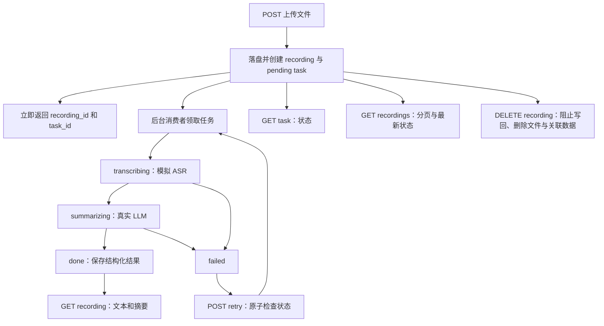

# 录音转写服务：需求分析与 10 小时开发测试计划

分析依据：同目录《后端实习生笔试项目：「录音转写服务」API.md》。本报告是设计与验收计划，尚未开发或执行测试。标为“建议”的内容是为落地补充的契约，不是题目原文要求。

## 1. 范围与优先级

- 必做：6 个核心接口、本地文件存储、异步状态机、模拟 ASR、真实 LLM 摘要、错误处理、日志、数据库迁移，以及可启动、可调试、可解释的交付材料。
- 本次新增硬约束：全局最多 3 个并发转写，纳入本轮核心交付。该约束来自后续讨论，原题将并发控制列为加分项。
- P0 完成后再开发：自动重试、运行中任务自动恢复、SSE、上传幂等、扩展测试、公开部署。本轮仅预留模块边界，不提前实现这些功能。基础验收测试仍随 P0 开发进行。
- 明确不考察：用户注册、登录、鉴权、前端、高并发性能优化。
- 原文估计工作量为 12～16 小时；压缩至 10 小时，应以核心功能闭环为目标，选用熟悉的技术栈，避免增加 Redis、对象存储、分布式队列等基础设施。
- 建议方案：Python + FastAPI + SQLite + 本地磁盘 + 3 个 asyncio 消费者协程。不引入独立消息队列，数据库中的 pending 任务作为持久化队列。数据库操作使用短事务，不在网络等待期间持有事务。
- 10 小时是本轮核心交付预算，加分项在核心验收通过后另排时间；当前只制定计划，尚未开始代码开发。

### 全局并发约束的落地范围

当前限定单机、同一数据库与本地存储目录，不考虑多机器文件共享。采用一个服务进程，内部启动 3 个消费者；每个消费者串行完成一段录音的转写与摘要。由此保证实际同时执行的 ASR 最多 3 个。该最小实现也把整个处理流水线限制为 3 个并发，摘要期间仍占用消费者，因此不保证 ASR 始终满载；未来可拆分两个阶段的执行池提高利用率。

不能仅依靠“每进程创建 Semaphore(3)”声称全局限额成立。P0 需要以下保障：

1. 启动配置固定单进程；后台消费者只在统一的服务生命周期入口启动。
2. 在启动清理与消费者创建前，对同一规范化数据目录取得操作系统级独占进程锁，持有到进程退出。第二个服务进程使用相同数据目录启动时，明确报错退出，不能再启动 3 个消费者。锁文件不能运行中删除重建，避免不同进程锁住不同文件。
3. 原子领取 pending 任务；同一个 task_id/attempt_no 不得同时执行两次。
4. 上传和手动重试仅写 pending，不能绕过消费者直接启动 ASR。
5. 超时或删除不等于底层执行已停止。ASR Mock 必须支持等待取消完成；消费者确认旧调用结束后才能接下一项，不通过后台残留调用额外制造并发。未来接入不可取消的真实 ASR 时需重新设计其执行名额管理。

这里的“全局”指当前单机服务及其共享数据目录。未来若允许多个 worker 进程同时工作，需要额外引入跨进程执行名额或统一 worker 部署策略；不把进程内限制直接带入多实例环境。

## 2. 接口清单及入参

| 级别 | 接口 | 入参位置与名称 | 是否必填 | 校验与约定 |
|---|---|---|---|---|
| P0 | `POST /v1/recordings` | multipart 文件字段 `file` | 是 | 原文要求文件存在、大小 ≤ 50MB、扩展名为 wav/mp3/m4a/aac；建议拒绝零字节文件、扩展名忽略大小写 |
| P0 | `GET /v1/tasks/{task_id}` | 路径 `task_id` | 是 | ID 格式合法且任务存在；无请求体 |
| P0 | `GET /v1/recordings` | query `page` | 建议可选 | 建议默认 1，必须为整数且 ≥ 1；原文未明确默认值与必填性 |
| P0 | `GET /v1/recordings` | query `page_size` | 建议可选 | 建议默认 20，范围 1～100；原文未明确默认值与上限 |
| P0 | `GET /v1/recordings/{id}` | 路径 `id` | 是 | 录音 ID，格式合法且记录存在；无请求体 |
| P0 | `POST /v1/tasks/{task_id}/retry` | 路径 `task_id` | 是 | 原文要求仅 failed 可重试，且处理重复请求；不需要请求体 |
| P0 | `DELETE /v1/recordings/{id}` | 路径 `id` | 是 | 删除录音、文件和关联数据；无请求体 |
| 选做 | `GET /v1/recordings/{id}/summary/stream` | 路径 `id` | 是 | SSE；10 小时计划不实现 |

补充说明：

1. `recording_id`、`task_id`、状态、时间戳、文件路径应由服务端生成，客户端不传。
2. `transcript` 是 ASR 阶段输出；`summary`、`key_points`、`todos` 是 LLM 输出，都不是上传接口入参。
3. `Authorization` 不属于本题必填参数；LLM API Key 是后端环境配置，不应由上传接口接收。
4. `Idempotency-Key` 仅在选做上传幂等时增加。本计划不要求上传去重；重复上传可以生成两条录音。
5. 建议将 50MB 明确约定为 `50 × 1024 × 1024` 字节，并在 README 写明。按实际读取的文件字节计数，不只信任 Content-Length；multipart 边界大小不计入文件大小。
6. 建议 ID 使用 UUID。格式错误返回 400，格式正确但不存在返回 404。

### 建议响应契约

- 上传：`202 Accepted`，响应保持题目格式：`{recording_id, task_id, status:"pending"}`。含义是已经接收且等待处理，不是转写成功。
- 任务查询：`200`，返回 `task_id, recording_id, status, attempt_no, error, created_at, updated_at`。直接使用 `transcribing` / `summarizing` 表达阶段，避免只返回模糊的 processing。
- 列表：`200`，返回 `{items, page, page_size, total}`；每项含录音信息、任务 ID 与最新状态。按 `created_at DESC, id DESC` 排序，第二排序键用于处理相同时间。
- 详情：`200`，返回录音信息与任务状态；done 时必须包含 transcript 与完整摘要。未完成时建议摘要为 null；摘要失败时可保留 transcript，便于排查。
- 重试：接受成功返回 `202`，返回原 task_id 与 pending；任务不存在 404，状态不允许或重复的并发重试返回 409。
- 删除：完成删除后返回 `204`，无响应体；不存在返回 404。发生文件清理失败时不得返回删除成功。

统一错误建议：`{"error":{"code":"TASK_NOT_RETRYABLE","message":"当前任务状态不允许重试","request_id":"..."}}`。

建议状态码：缺参/格式/分页参数错误 400，资源不存在 404，任务状态冲突 409，文件过大 413，扩展名不支持 415，内部持久化或文件操作失败 500。框架默认的 422 校验错误需统一映射，或在文档中明确采用 422 的一致规则。LLM 失败属于已接收任务的异步失败，任务查询本身仍返回 200，并在数据里显示 failed 与错误原因。

## 3. 多接口关联与状态机

接口并非相互 HTTP 调用，而是通过同一录音、任务与后台状态机协作：

| 关联 | 关键约束 |
|---|---|
| 上传 → 查询任务 | 上传返回的 task_id 必须可立即查到；文件和数据库提交完成后才能响应成功 |
| 上传 → 列表/详情 | recording_id 是录音查询与删除的主键；列表展示的状态必须来自任务数据 |
| 转写 → 摘要 | 只有转写成功且保存 transcript 后才调用 LLM；转写失败不得调用 LLM |
| 完成 → 详情 | 保存结果与将状态置为 done 应在同一数据库事务中完成，避免出现 done 但无结果 |
| 重试 → 后台处理 | 仅 failed → pending；不得因同时点击两次启动两条流水线 |
| 删除 → 后台处理 | 删除可能遇到排队、ASR 或 LLM 运行中，必须阻止后台结果重新写回 |

### 重试的最小可靠设计

本计划复用同一个 task_id，每条录音仅有一个任务。手动重试增加 `attempt_no`、清理上次错误与结果，并从 ASR 重新执行；不额外创建新 task_id。原文未规定重试是否新建任务，此选择应写入 README。

- 用条件更新 `UPDATE tasks ... WHERE id=? AND status='failed'` 实现 failed → pending，检查影响行数，而不是先查询再无条件更新。
- 同一轮并发请求只有一个成功，其余返回 409；消费者领取任务也使用 pending → transcribing 的条件更新。
- 后台写回时同时检查 task_id、attempt_no、当前阶段及录音仍可用，避免旧执行结果覆盖新一轮结果。
- 该方案防止同一失败轮次被并发重复提交。若请求延迟到下一次再次 failed，可能触发新一轮重试；如需要跨失败轮次严格幂等，再增加请求幂等键与幂等记录，不把这一额外保证混入最小实现。

### 删除与文件一致性

数据库事务不能原子覆盖磁盘删除。建议给录音增加 `lifecycle=active/deleting`：先标记 deleting 并使后台失去写入资格，再删除文件，最后在事务中删除任务和录音。文件已不存在按清理成功处理；其他磁盘错误保留 deleting 标记并返回错误，允许再次 DELETE 继续清理。启动时补做 deleting 记录清理。

**进入 deleting 后，列表排除该录音，详情与任务查询可返回 409 RESOURCE_DELETING；删除完成后返回 404。后台即使无法立即取消已发出的 LLM 请求，也必须丢弃其结果，禁止重新创建已删除记录。**

上传则先存临时文件、校验大小和扩展名，生成服务端文件名后移至正式位置，再用一个事务创建录音与任务；正常异常时清理文件。进程在文件落盘与事务提交之间崩溃仍可能产生孤儿文件，需作为已知限制说明，后续可增加定时清理。

### 服务重启

原文强制要求解释重启行为，但“恢复继续执行”是选做。10 小时版本建议：

- pending 留在数据库，由启动后的消费者重新领取。
- 单进程服务启动时，将遗留 transcribing/summarizing 标记为 failed，错误码 `WORKER_INTERRUPTED`，允许客户端手动重试。
- 不宣称已实现运行中任务断点恢复。以上处理也避免任务永久卡死。
- 此启动清理策略仅适用于单进程、单实例；不能直接扩展到多实例，否则可能误判其他实例的任务。

## 4. 数据库表设计

### 必需表 1：recordings

| 字段 | 建议类型/约束 | 用途 |
|---|---|---|
| id | TEXT PK | UUID 录音 ID |
| original_filename | TEXT NOT NULL | 原文件名，仅作元数据 |
| storage_path | TEXT NOT NULL UNIQUE | 服务端生成的存储路径，不作为客户端可指定路径 |
| extension | TEXT NOT NULL | wav/mp3/m4a/aac |
| size_bytes | INTEGER NOT NULL CHECK > 0 | 实际文件大小，并约束不超过约定上限 |
| lifecycle | TEXT NOT NULL，active/deleting | 删除协调状态，与处理状态分开 |
| created_at | UTC 时间，NOT NULL | 排序与审计 |
| updated_at | UTC 时间，NOT NULL | 修改时间 |

### 必需表 2：tasks

| 字段 | 建议类型/约束 | 用途 |
|---|---|---|
| id | TEXT PK | UUID 任务 ID |
| recording_id | TEXT NOT NULL UNIQUE FK | 指向 recordings.id；本版本一对一 |
| status | TEXT NOT NULL CHECK | pending/transcribing/summarizing/done/failed |
| attempt_no | INTEGER NOT NULL DEFAULT 1 | 手动重试轮次及阻止旧任务写回 |
| transcript | TEXT NULL | ASR 结果 |
| summary_json | TEXT NULL | 序列化的结构化摘要，应用层做 schema 校验 |
| error_code | TEXT NULL | 如 ASR_FAILED、LLM_TIMEOUT、LLM_INVALID_OUTPUT |
| error_message | TEXT NULL | 脱敏错误信息 |
| created_at / updated_at | UTC 时间，NOT NULL | 创建与更新时间 |
| started_at / finished_at | UTC 时间，NULL | 当前轮次耗时与终态时间 |

索引建议：`recordings(created_at DESC, id DESC)` 和 `tasks(status, created_at)`；recording_id 的 UNIQUE 同时提供关联索引。外键设置 ON DELETE CASCADE，SQLite 每个连接启用外键约束。

“最新任务状态”不强制要求一条录音拥有多条任务；在本版本中，唯一任务的当前状态即最新状态。如果后续需要保存每次完整处理历史，可取消 recording_id 唯一约束，改为一对多并定义最新任务选择规则，或增加 task_attempts 表。

不必建用户表、权限表、独立文件表、独立摘要表、摘要要点表或待办表。当前只整体查询摘要，数组保存到 JSON 即可；未来若对待办逐条编辑或检索，再拆子表。

## 5. 是否分库分表、是否鉴权

**不需要分库分表。** 文档明确不考察高并发，也未提供需要分片的数据规模。单库配合正确索引、分页和短事务足够完成本题。音频在磁盘保存，数据库仅存元数据和文本。耗时主要来自模拟 ASR 与外部 LLM，分片不会缩短这些等待。

也不必为了本题先引入读写分离、Redis 或分布式锁。若将来出现经测量确认的数据库瓶颈，再评估数据库类型、连接数、查询与存储策略，最后再讨论分片。

**本题不需要接口鉴权。** 原文明示不考察注册、登录、鉴权，因此 10 小时计划不分配相关工作。无鉴权的设计意味着没有用户隔离；UUID 不是授权机制。如果另行决定真实公网开放，则应重新评估 API Key、限流与所有权校验，不能把本地作业版本直接当成多用户服务。

仍需完成基本实现卫生：LLM Key 从环境变量读取，不提交到仓库、不写日志；服务端随机命名文件，不能把用户文件名拼入存储路径；错误和日志不泄露 Key 或绝对路径。扩展名校验按题目实现，不扩展为耗时的音频内容识别。

## 6. LLM 与 Mock 的边界

- 正常运行：ASR 使用 5～15 秒随机耗时和约 20% 失败概率；摘要默认使用真实 LLM。
- 自动化测试：注入可控制成功/失败、可替换 sleep 的 ASR 和 LLM 测试替身，避免随机导致测试不稳定。
- LLM 必测错误：超时、网络异常、非成功 HTTP 响应、非 JSON、JSON 缺字段、字段类型错误。不能把“能 JSON.parse”当成输出合格。
- 输出 schema：summary 为字符串；key_points、todos 为字符串数组，允许空数组；若额外要求非空摘要，应明确写成应用规则。
- 建议配置独立的 LLM 超时，例如 30 秒。超时必须持久化 failed，释放消费者处理能力，不能永久停在 summarizing。
- Mock 测试通过仅说明应用逻辑通过，不证明真实 LLM 可用。最终至少保留一次真实调用得到合法结构化结果的验证。

## 7. 10 小时分阶段开发与 Mock 验收指标

下表的用例数和耗时指标是本计划的验收目标，不是已测结果，也不是题目原文的性能 SLA。时间按累计小时计算，总计恰好 10 小时。

| 时间段 | 用时 | 开发内容与阶段产物 | 完成后的 Mock/验证指标 |
|---|---|---|---|
| 0:00～0:30 | 0.5h | 固定接口契约、目录结构、配置、响应格式；立即验证 LLM 凭证与可达性 | 应用可启动；配置可加载；真实 LLM 至少完成一次最小探测，尽早发现外部阻塞 |
| 0:30～1:30 | 1h | 两张表、迁移、状态枚举、统一异常与基础日志 | 6 项持久化检查全过：空库迁移、重复启动、外键、状态约束、事务回滚、分页排序 |
| 1:30～3:00 | 1.5h | 上传、磁盘落盘、录音与任务事务创建、大小限制 | 10 个上传用例全过：4 种允许扩展名、缺 file、零字节、不支持扩展名、恰好 50MiB、超 1 字节、数据库失败后文件补偿；另测 1MiB 本地上传 20 次 P95 < 1s，故意阻塞 worker 15s 时上传仍返回 |
| 3:00～5:00 | 2h | 单进程独占锁、3 个消费者、原子领取、ASR Mock、LLM 适配、结果校验与阶段日志 | 8 条可控路径全过；ASR 失败时 LLM 调用次数为 0；积压任务时实际 ASR 并发峰值达到 3 且从不超过 3；同数据目录第二进程启动失败 |
| 5:00～6:30 | 1.5h | 任务查询、分页列表、录音详情 | 12 个查询用例全过：5 种状态、缺省分页、非法 page、非法 page_size、倒序、空列表、不存在任务、不存在录音；done 详情的 transcript 与摘要完整率 100% |
| 6:30～7:30 | 1h | 条件更新领取与重试、attempt_no 校验 | 覆盖 5 种状态与不存在任务；将重试后的新执行阻塞，20 个并发 retry 请求恰好 1 个 202，其余 409；attempt_no 仅 +1；旧 attempt 写回成功数为 0 |
| 7:30～9:00 | 1.5h | 各阶段删除、文件异常处理、最小启动清理、全局并发与关键路径集成测试 | 5 种处理状态下删除均通过；删除后录音/任务/文件均不存在；迟到写回新增数据数为 0；模拟文件删除失败时不误报成功；重启后 pending 可领取、处理中遗留任务变 failed；混合上传/重试/删除时 ASR 并发始终 ≤3 |
| 9:00～10:00 | 1h | 一键启动、.env.example、README 架构图与表设计、.http/curl 文件、干净环境回归 | 6 个核心接口调试文件齐全；全部已定义用例通过；从空库一条命令启动并完成上传→查询→结果闭环；至少一次真实 LLM 成功；日志能按 task_id 还原状态、轮次与错误 |

每阶段保留一次有意义的 commit，避免最后一次性提交。第 1 阶段就准备启动脚本骨架，最后阶段负责验证，避免最后一小时才解决依赖与启动问题。

### Mock 指标的测量方法

1. **确定性优先**：主要回归用例固定随机源或注入成功/失败；等待阶段用事件屏障精确卡住，再查询状态或触发删除，避免依赖碰巧的时序。
2. **ASR 规则验证**：注入随机边界值，确认耗时取值落在 5～15 秒且失败判定阈值为 0.2。可固定随机种子抽样 1,000 次、不实际等待，失败率 15%～25% 只作分布冒烟检查；它不能替代边界单测，也不要求 10 次任务恰好失败 2 次。
3. **异步验收**：让 worker 等待一个未释放事件，在释放前确认上传已经得到 202、查询可读到任务。P95 < 1s 仅为 1MiB 文件、同机测试目标，不适用于 50MiB 上传或慢网络；记录机器与样本数。
4. **LLM 超时验收**：测试环境设 0.1 秒超时，让假上游始终不返回；目标是在 1 秒内观察到 failed 与 LLM_TIMEOUT。运行环境的建议超时另行配置为 30 秒，不混用测试值。
5. **资源一致性**：每次成功删除后检查主表行数、关联行数、磁盘存在性三个维度；模拟后台晚到结果，确认不会“复活”。
6. **结果一致性**：分别验证 tasks、列表和详情在同一稳定状态下的结果一致；轮询跨状态转换看到不同时间快照并不等于数据错误。
7. **全局并发**：提交 10 段录音，在 ASR 测试替身入口/出口维护实际活跃计数并用事件屏障阻塞；确认峰值为 3、其余 7 段 pending。只释放一项并阻塞其摘要，验证本版本整条流水线占位规则；摘要完成后恰好补入一项。随后混合失败、手动重试、删除，峰值仍不得超过 3。不能仅通过数据库里 transcribing 的行数推断实际并发。
8. **单机全局保护**：使用同一数据目录同时启动两个服务进程，只有一个能启动消费者；第二个明确失败，不能执行启动清理影响首个进程。首个退出后，后续进程能够重新获取锁并启动。此项验证单独使用真实子进程，不用 Mock 锁代替。

## 8. 交付与取舍

应交付代码仓库及完整提交历史、README、一键启动入口、迁移脚本、API 调试文件、测试代码与实际测试结果。README 明确说明：单进程边界、重启处理、重试复用 task_id、删除语义、环境变量、Mock 与真实 LLM 的切换、已知问题。

10 小时内完成 P0、全局最多 3 个并发转写及基础验收；不安排 SSE、自动指数退避、上传去重、公网部署、鉴权、分库分表。使用 3 个协程消费者和单机进程独占锁，不增加线程池作为主要调度机制，不引入 Kafka、Redis 或 RabbitMQ。独立消息队列与多进程 worker 属于未来架构扩展，不是本轮交付内容。

如果进度落后，先取消任何尚未开始的加分扩展，保留 P0 异常处理、核心测试和运行文档。如果真实 LLM 受凭证或外部服务阻塞，应如实标记未完成；仅在题目允许的兜底下采用摘要 Mock，并在 README 说明会影响评分，不能把纯 Mock 测试写成真实 LLM 验证通过。

## 9. P0 开发任务清单与依赖

以下均待开发，按顺序推进；每项的验收用例在对应功能完成后执行。

| 编号 | 核心任务 | 具体交付 | 前置依赖 |
|---|---|---|---|
| P0-01 | 工程与契约 | 项目骨架、配置、.env.example、统一错误结构、启动入口；固定分页/大小/重试语义，探测真实 LLM | 无 |
| P0-02 | 数据持久化 | recordings/tasks 两张表、迁移、索引、外键、短事务、条件状态更新；attempt_no | P0-01 |
| P0-03 | 上传 | file 校验、本地安全命名、流式大小限制、异常文件补偿、事务创建记录与任务、立即返回 202 | P0-02 |
| P0-04 | 全局调度 | 数据目录独占进程锁、3 个协程消费者、原子领取、失败隔离、退出时取消并等待；处理中的遗留任务启动时标记失败 | P0-02 |
| P0-05 | ASR 与 LLM | ASR 随机 5～15 秒/约 20% 失败；真实 LLM、超时与结构校验；合法状态机、结果事务写回、生命周期日志 | P0-04 |
| P0-06 | 三个查询接口 | 任务状态、分页倒序列表及最新状态、详情与完整结果；400/404 处理 | P0-02、P0-05 用于完整联调 |
| P0-07 | 手动重试 | 仅 failed 原子重置 pending，轮次递增、旧字段清理、防重复请求和旧轮次写回 | P0-04、P0-05 |
| P0-08 | 删除 | deleting 协调、阻止新领取及旧结果写回、磁盘删除、关联数据删除、失败可继续清理 | P0-03～P0-07 |
| P0-09 | 验收与提交材料 | 基础 Mock/集成用例、真实 LLM 验证、全局并发测试、一键启动验证、README 图与表设计、API 调试文件、分阶段 commit | 全部核心功能 |

### 进入加分开发前的完成门槛

- 六个接口完整可调用，正常与异常契约一致。
- 完整异步链路可运行，ASR 模拟符合题目，至少一次真实 LLM 摘要结构合法。
- 实际转写并发上限、积压排队、原子领取、重试、删除竞争全部通过验证。
- 服务重启行为明确且与实现一致；不把“标记失败、允许手动重试”描述为“自动恢复”。
- 一键启动、迁移、日志、API 调试文件与 README 齐全，核心回归无失败。
- 如出现阻塞或未完成项，先处理或如实记录，不以加分开发替代未完成的 P0。

## 10. 加分项只预留边界，P0 通过后再实施

| 后续顺序 | 加分项 | 本轮预留方式 | P0 后增加的实际工作 |
|---|---|---|---|
| 1 | 扩展测试 | ASR/LLM 可注入，时间与随机源可替换 | 更全面的故障注入、长时间回归与自动化执行 |
| 2 | 失败自动重试 | 处理阶段返回可分类错误，重试决策与业务处理分离 | 区分可重试错误；独立自动重试计数；最多 3 次及指数退避；退避期间释放执行资源 |
| 3 | 服务重启自动恢复 | transcript 持久化，ASR/摘要是独立可调用模块 | 按已完成阶段恢复；执行所有权检查；处理重复外部调用与崩溃窗口 |
| 4 | 上传幂等 | 上传服务与存储、持久化逻辑分离 | 幂等键/文件哈希策略、唯一约束、请求冲突与并发重复上传测试 |
| 5 | LLM 流式输出 | LLM 适配器与 HTTP 路由分离 | SSE 接口、事件协议、客户端断线处理、最终结构校验；不影响普通详情查询 |
| 6 | 简单部署 | 环境配置外置，一键启动可复现 | 公网部署、密钥管理及必要的访问保护；按部署环境重新检查全局并发边界 |

并发控制已因本次需求提前纳入核心交付，不重复列作待开发加分项。预留扩展只做必要的函数/模块分离，不提前创建暂时无用途的数据库表、接口或基础设施。当前的 attempt_no 表示手动执行轮次，后续自动重试策略需要另定计数语义，不能直接混用。
